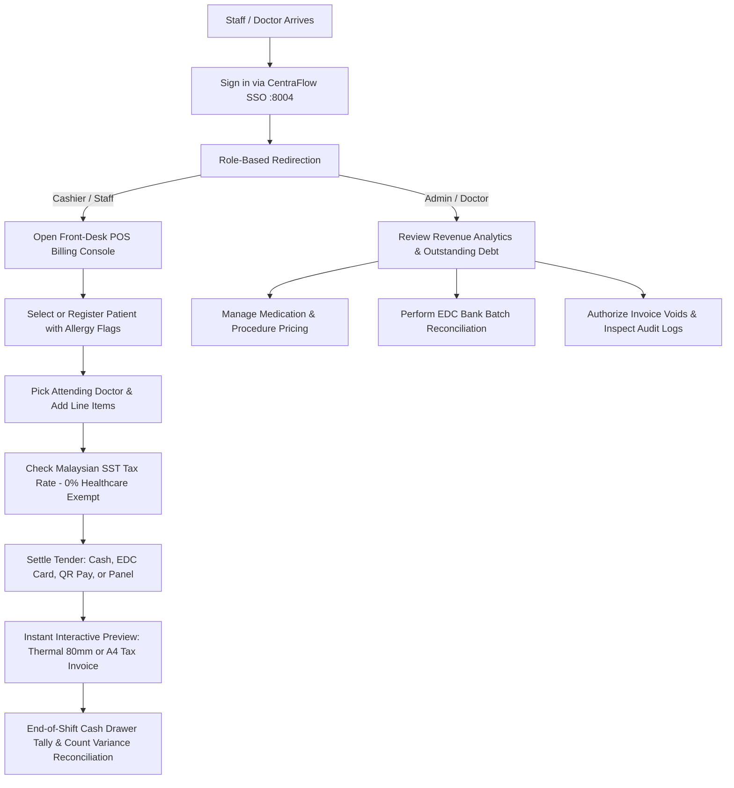

# User Roles & Operating Workflows Guide

Comprehensive guide to Role-Based Access Control (RBAC), daily clinical billing operating procedures, cash drawer governance, and CentraFlow SSO integration within the **Clinic Invoice System (CIS)**.

---

## 1. Role Comparison & Permissions Matrix

ClinicFlow enforces strict segregation of duties between Administrative/Doctor oversight and Front-Desk Cashier operations.

| Operational Capability | 👑 Administrator / Doctor | 💳 Cashier / Front-Desk Staff |
| :--- | :---: | :---: |
| **Authentication via CentraFlow SSO (:8004)** | ✅ Yes (`ADM-001`) | ✅ Yes (`STF-001`) |
| **POS Invoice Generation (Catalog Multi-Select)** | ✅ Yes | ✅ Yes |
| **Patient Registration & Allergy Alerts** | ✅ Yes | ✅ Yes |
| **Front-Desk Tender Settlement (Cash, EDC, QR, Panel)** | ✅ Yes | ✅ Yes |
| **Thermal 80mm & A4 Modal Preview & Printing** | ✅ Yes | ✅ Yes |
| **Daily Cash Drawer Balancing & Shift Closeout** | ✅ All Counters | ✅ Own Counter Shift |
| **Treatment, Medication & Lab Item Catalog Management** | ✅ Full CRUD | ❌ Read-Only / Invoicing Only |
| **Bank Reconciliation & EDC Batch Matching** | ✅ Full Reconcile | ❌ Access Restricted |
| **Multi-Period Revenue Velocity Analytics** | ✅ Day / Week / Month / Year | ❌ Access Restricted |
| **Invoice Void Authorizations (with Audit Reason)** | ✅ Permitted | ❌ Blocked |
| **Immutable System Audit Trail Inspection** | ✅ Full Access | ❌ Access Restricted |
| **Clinic SSM & Profile Configuration** | ✅ Permitted | ❌ Access Restricted |

---

## 2. Daily Standard Operating Procedures (SOP)

### Flow 1: Front-Desk Patient Invoicing & POS Settlement
1. **Patient Check-in**: Front-desk cashier selects an existing registered patient using the real-time search modal, or clicks **Register Patient** to capture IC/Passport, contact details, and vital allergy alerts (e.g. *Penicillin, NSAIDs*).
2. **Consulting Physician Assignment**: Assign the attending doctor responsible for the clinical consultation.
3. **Item Catalog Selection**:
   - Filter items by category tabs: `All`, `Consultation`, `Medication`, `Procedure`, or `Lab`.
   - Toggle item checkboxes in the 10-row scrollable catalog table. Items automatically appear in the active invoice line items with quantity controls.
4. **SST Compliance**: Consultations, essential prescription medicines, and basic diagnostics calculate at `0% SST` by default. Taxable services automatically compute statutory rates (`6%` or `8%`).
5. **Tender Settlement**:
   - Select tender method: `Cash` (with change calculator and quick denomination buttons), `EDC Terminal Card`, `DuitNow QR Pay`, `Online Transfer`, or `Insurance Panel / GL`.
   - For Card / QR payments, capture terminal Reference Number (RRN) or Batch Number.
6. **Receipt Emission**:
   - Click **Preview & Print** to launch the interactive modal.
   - Choose **80mm Thermal Slip** (with clinic SSM, barcode, allergy warnings) or **A4 Tax Invoice**.

### Flow 2: Shift Cash Drawer Balancing
1. At the conclusion of a shift, cashiers open the **Cash Drawer Balancing** terminal.
2. System computes expected cash collections from today's receipts.
3. Cashier enters the physical cash count (notes and coins).
4. System highlights any cash variance (`Surplus` or `Deficit`) for supervisor sign-off.

### Flow 3: Bank Reconciliation & EDC Batch Clearance (Administrator)
1. Medical Director or Practice Accountant opens the **Bank Reconciliation** portal.
2. Filter transactions by banking partner (*Maybank DuitNow, CIMB Bank, Public Bank, Hong Leong EDC, RHB Terminal*).
3. Cross-reference terminal batch slips against system payment records.
4. 1-Click reconcile marks payments as verified with audit logging.

### Flow 4: Invoice Voiding & Immutable Governance
1. If an invoice was created in error or patient queue cancelled, only an **Administrator** can void the invoice.
2. Voiding requires a mandatory textual justification.
3. The invoice status transitions to `Void` and records an immutable log entry in `audit_logs` storing user ID, timestamp, IP address, user-agent, and before/after payloads.

---

## 3. Central Single Sign-On (SSO) Authentication Flow

CIS is unified with **CentraFlow Identity Hub** (`http://localhost:8004`):

1. **OAuth 2.0 Authorization Code Grant**: Users click **Sign in with CentraFlow SSO** at `http://localhost:8003/login`.
2. **Authentication at Central Hub**: CentraFlow authenticates the staff credentials and verifies granted scopes (`invoice:manage invoice:read`).
3. **Local Profile Provisioning**: The callback (`/auth/callback`) seamlessly links the corporate profile, stores `centraflow_uuid`, and establishes the local session.
4. **Central Single Logout (SLO)**: Logging out terminates the session across both CIS and CentraFlow, redirecting back to `http://localhost:8003/login?logged_out=1` with an emerald dismissal alert.
