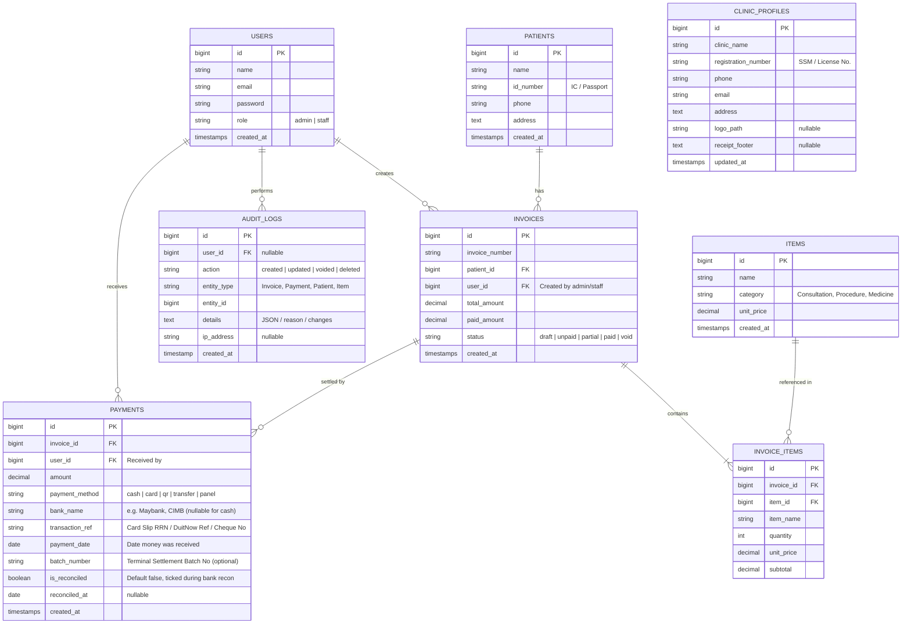

# Clinic Invoice System (CIS)

> **Requirements Specification & Test Plan Document**

---

## 1. Project Overview

The **Clinic Invoice System (CIS)** is a web-based billing and invoicing platform designed for small-to-medium medical clinics. It streamlines patient billing, medication/treatment line items, payment tracking, and receipt/invoice generation (with support for standard PDF and thermal receipts).

### Technology Stack

* **Backend Framework:** Laravel 12 (PHP 8.2+)
* **Database:** SQLite / MySQL / PostgreSQL
* **Frontend & Styling:** Blade Components / Vanilla JavaScript / Tailwind CSS (Light & Dark Theme)
* **Identity & Authentication:** CentraFlow Identity Hub (`:8004`) OAuth 2.0 Client (Laravel Passport) with Single Sign-On (SSO) & Central Single Logout (SLO)
* **Animations:** Animate.css (modals, alerts, invoice transitions)
* **Icons & Typography:** Boxicons (`bx`), Plus Jakarta Sans, JetBrains Mono
* **PDF & Print Engine:** Interactive modal preview with 80mm ESC/POS thermal receipt & A4 formal tax invoice output

---

## 2. System Requirements Specification (SRS)

### 2.1 User Roles, Permissions & SSO Authentication

* **Authentication Architecture:** Single Sign-On (SSO) centrally authenticated via CentraFlow (`:8004`) using Authorization Code Grant with scopes (`invoice:manage`, `invoice:read`).
* **Admin / Doctor (`ADM-001`):** Full system access (manage treatment/medication catalog, executive multi-period revenue tracking, EDC bank reconciliation, tamper-proof activity audit log inspection, invoice void authorizations).
* **Receptionist / Cashier (`STF-001`):** Front-desk POS billing access (multi-select catalog, patient registration with allergy alerts, tender settlement, thermal receipt/A4 printing, end-of-shift cash drawer balancing).

### 2.2 Functional Requirements (FR)

#### Module 1: Patient Management
* **FR-1.1:** Register patient records (Name, IC/Passport, Phone, Date of Birth, Gender, Allergies, Address).
* **FR-1.2:** Real-time search for patients (by Name, Phone, or IC number).
* **FR-1.3:** View patient profile with billing history and outstanding balances.

#### Module 2: Treatment & Medication Catalog (Item Master)
* **FR-2.1:** Manage catalog items (Consultation, Procedures, Lab Tests, Medications).
* **FR-2.2:** Define item Code/SKU, Category, Unit Price, Tax Rate, and Medication Stock Quantities.

#### Module 3: Invoice Generation & Management
* **FR-3.1:** Create new invoices linked to a patient and attending doctor.
* **FR-3.2:** Dynamic line items with real-time automatic calculation:
  $$\text{Line Total} = (\text{Unit Price} \times \text{Quantity}) - \text{Discount} + \text{Tax}$$
* **FR-3.3:** Invoice status lifecycle: `Draft` $\rightarrow$ `Unpaid` $\rightarrow$ `Partially Paid` $\rightarrow$ `Paid` / `Void`.
* **FR-3.4:** **Interactive PDF Preview:** Instant in-browser PDF preview modal (zoom, page navigation) before printing or downloading.
* **FR-3.5:** Output formats: A4 formal invoice PDF and 80mm thermal receipt.

#### Module 4: Payment Processing & Bank Reconciliation
* **FR-4.1:** Multi-channel payment options (Cash, Credit/Debit Card, QR Pay / DuitNow, Online Transfer, Insurance/Panel).
* **FR-4.2:** Capture audit references for reconciliation (`bank_name`, `transaction_ref` / RRN, `batch_number`, `payment_date`).
* **FR-4.3:** Support split payments (e.g., Cash + Card) and deposit deductions.
* **FR-4.4:** Issue automated payment receipts with payment breakdown.

#### Module 5: Reporting, Cash Drawer & Bank Reconciliation
* **FR-5.1:** Daily collection summary grouped by payment method and receiving bank (e.g., Total Cash, Total Maybank Card, Total CIMB DuitNow).
* **FR-5.2:** End-of-day EDC card settlement batch tally for matching with credit card terminal reports.
* **FR-5.3:** Bank reconciliation view (mark payments as reconciled against bank statements).
* **FR-5.4:** Monthly revenue, aging unpaid bills, and top billed treatments.

#### Module 6: Clinic Profile & Settings
* **FR-6.1:** Manage clinic identity (Clinic Name, SSM/Registration No., Phone, Email, Address, Logo).
* **FR-6.2:** Set default invoice & thermal receipt header/footer notes and terms.

#### Module 7: Audit Trail & Activity Logging
* **FR-7.1:** Automatically log sensitive events (invoice voided, payment deleted/refunded, item price altered).
* **FR-7.2:** Record user, timestamp, action type, IP address, and void reason/change diff.

### 2.3 Non-Functional Requirements (NFR)

* **Performance:** Invoice generation and calculation response time must render in $< 300\text{ ms}$.
* **Security:** Role-Based Access Control (RBAC via Laravel Policies / Spatie), encrypted patient data, and audit logging for voided transactions.
* **Usability & UI/UX:**
  * Clean, responsive interface built with Tailwind CSS.
  * Contextual visual indicators with Lucide Icons (`Receipt`, `UserPlus`, `CreditCard`, `Printer`, `Stethoscope`).
  * Smooth micro-interactions via Animate.css (e.g., `animate__animated animate__fadeInUp` for modal dialogs and toast alerts).

---

## 3. Database Schema Overview



---

## 4. UI/UX Style Guide

| Element | Tailwind CSS Specification | Icon / Animation |
| :--- | :--- | :--- |
| **Primary Buttons** | `bg-emerald-600 hover:bg-emerald-700 text-white rounded-lg px-4 py-2 font-medium shadow-sm transition` | `<i data-lucide="plus-circle"></i>` |
| **Status Badge: Paid** | `bg-emerald-100 text-emerald-800 text-xs px-2.5 py-0.5 rounded-full font-semibold` | `<i data-lucide="check-circle-2"></i>` |
| **Status Badge: Unpaid** | `bg-amber-100 text-amber-800 text-xs px-2.5 py-0.5 rounded-full font-semibold` | `<i data-lucide="clock"></i>` |
| **Status Badge: Void** | `bg-rose-100 text-rose-800 text-xs px-2.5 py-0.5 rounded-full font-semibold` | `<i data-lucide="x-circle"></i>` |
| **Payment Modal** | `fixed inset-0 bg-slate-900/50 backdrop-blur-sm flex items-center justify-center` | `animate__animated animate__zoomIn animate__faster` |
| **Success Toast** | `bg-white border-l-4 border-emerald-500 shadow-lg p-4 rounded-r-lg` | `animate__animated animate__fadeInRight` |

---

## 5. Comprehensive Test Plan

### 5.1 Test Scope

* **Unit Tests:** Line item calculations, tax/discount computations, model relationships.
* **Feature Tests:** Patient onboarding, invoice creation flow, payment settlements, PDF rendering.
* **UI/UX Tests:** Responsiveness across screen sizes, Animate.css modal transitions, Lucide icon rendering.

---

### 5.2 Test Cases Matrix

#### Category A: Patient Management

| Test ID | Test Scenario | Steps | Expected Result | Priority |
| :--- | :--- | :--- | :--- | :--- |
| **TC-PAT-01** | Register new patient with valid data | Submit patient registration form with required fields | Patient saved to DB; success toast appears (`animate__fadeInRight`) | High |
| **TC-PAT-02** | Prevent duplicate IC/Passport | Submit registration with existing IC number | Validation error displayed: *"IC number already exists"* | High |
| **TC-PAT-03** | Real-time patient search | Type name into invoice patient lookup | Matching patient list renders instantly with Lucide icons | Medium |

#### Category B: Invoice Calculations & Creation

| Test ID | Test Scenario | Steps | Expected Result | Priority |
| :--- | :--- | :--- | :--- | :--- |
| **TC-INV-01** | Dynamic line total calculation | Add 2 units of Item A ($30.00) with $6.00 discount | Line total displays: $(2 \times 30) - 6.00 = \$54.00$ | Critical |
| **TC-INV-02** | Add/Remove line items | Click "Add Item" button and delete an item | New row animates in (`animate__fadeIn`); totals update automatically | High |
| **TC-INV-03** | Generate unique invoice number | Submit finalized invoice | Invoice stored with formatted sequence (e.g., `INV-2026-0001`) | Critical |

#### Category C: Payments & Status Flow

| Test ID | Test Scenario | Steps | Expected Result | Priority |
| :--- | :--- | :--- | :--- | :--- |
| **TC-PAY-01** | Full payment recording | Process full balance payment via Cash | Status updates to `Paid` (emerald badge); receipt print enabled | Critical |
| **TC-PAY-02** | Partial payment recording | Total is $100; record $40 payment | Status updates to `Partially Paid` (amber badge); balance displays $60 | High |
| **TC-PAY-03** | Overpayment prevention | Attempt payment higher than remaining balance | System displays validation error: *"Amount exceeds outstanding balance"* | Medium |

#### Category D: PDF Export, Preview & Printing

| Test ID | Test Scenario | Steps | Expected Result | Priority |
| :--- | :--- | :--- | :--- | :--- |
| **TC-PRN-01** | Real-time PDF preview modal | Click "Preview Invoice" on invoice page | Modal pops up (`animate__zoomIn`) rendering the generated A4 PDF inline with download/print controls | High |
| **TC-PRN-02** | Download invoice PDF | Click "Download PDF" from preview modal or list | Downloads formatted PDF with clinic header, items, and totals | High |
| **TC-PRN-03** | Thermal receipt layout | Trigger print dialog in 80mm mode | Output fits thermal receipt width without clipping text or barcodes | Medium |

---

## 6. Automated Testing Implementation (Laravel Pest / PHPUnit Example)

```php
// tests/Feature/InvoiceTest.php

use App\Models\User;
use App\Models\Patient;
use App\Models\Invoice;
use App\Models\Item;

it('calculates total correctly and stores invoice', function () {
    $user = User::factory()->create();
    $patient = Patient::factory()->create();
    $item = Item::factory()->create(['unit_price' => 50.00]);

    $response = $this->actingAs($user)->post(route('invoices.store'), [
        'patient_id' => $patient->id,
        'items' => [
            ['item_id' => $item->id, 'quantity' => 2, 'discount' => 5.00],
        ],
        'payment_method' => 'cash',
    ]);

    $response->assertRedirect();
    
    $this->assertDatabaseHas('invoices', [
        'patient_id' => $patient->id,
        'total_amount' => 95.00,
        'status' => 'paid',
    ]);
});
```